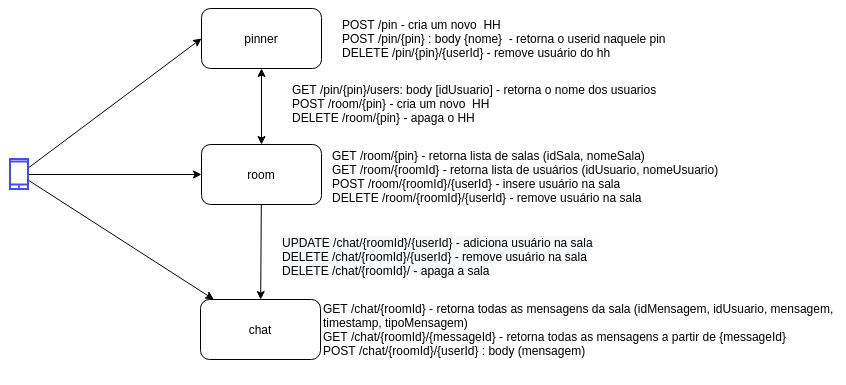

# happy-web-hour


## Arquitetura




## Testando
Baixe os projetos [pinner](https://github.com/happy-web-hour/pinner), [room](https://github.com/happy-web-hour/room) e [chat](https://github.com/happy-web-hour/chat).
Após isso execute o [docker-compose-local.yml](./docker-compose-local.yml). Para simplificar, execute o comando:
```bash
docker-compose -f docker-compose-local.yml up
```
**obs.:** é importante que sua estrutura de pasta esteja como listado e que o _docker_compose_ seja executado dentro da pasta **docs**.
.
├── chat
├── docs
├── pinner
└── room

## pinner
### APIs
- POST /pin - cria um novo HH  

**Request**

**Response**
200
```json 
{
	"pin": "string"
}
```	
- POST /pin/{pin} - retorna o userid naquele pin  
**Request**
```json
{
	"name": "string"
}
```
**Response**
200 
```json
{
	"userId": "string"
}
```
404 - Pin not found

- DELETE /pin/{pin}/{userId} - remove usuário do hh

**Request**

**Response**
200 

- GET /pin/{pin}/users - retorna o nome dos usuarios

**Request**
```json 
[
	"string"
]
```	

**Response**
200
```json 
[
	{
		"userId": "string",
		"name": "string"
	}
]
```	

### Database
Schema:
```json
[
	{
		"pin":"string",
		"users":[
			{
				"userId": "string",
				"name": "string"
			}	
		]
	}
]
```

## room
### APIs
- GET /room/{pin} - retorna lista de salas

**Request**	

**Response**
200
```json 
[
	{
		"roomId": "string",
		"name": "string"
	}
]
```	

- POST /room/{roomId}/{userId} - insere usuário na sala  

**Request**	

**Response**
200

- GET /room/{roomId} - retorna lista de usuários

**Request**	

**Response**
200
```json 
[
	{
		"userId": "string",
		"name": "string"
	}
]
```	

- DELETE /room/{roomId}/{userId} - remove usuário na sala

**Request**	

**Response**
200

- POST /room/{pin} - cria um novo Happy Hour

**Request**	

**Response**
200

- DELETE /room/{pin} - apaga o Happy Hour

**Request**	

**Response**
200

### Database
```json
[
	{
		"pin":"string",
		"rooms":[
			{
				"roomId": "string",
				"name": "string",
				"users": [
					"string"
				]
			}	
		]
	}
]
```

## Chat
### APIs
- POST /chat/{roomId} - Cria sala

**Request**	

**Response**
200

- GET /chat/{roomId} - retorna todas as mensagens da sala 

**Request**	

**Response**
200
```json 
[
	{
		"messageId": "string",
		"userId": "string",
		"message": "string",
		"timestamp": "string",
		"type": "string"
	}
]
```	

- GET /chat/{roomId}/{messageId} - retorna todas as mensagens a partir do messageId

**Request**	

**Response**
200
```json 
[
	{
		"messageId": "string",
		"userId": "string",
		"message": "string",
		"timestamp": "string",
		"type": "string"
	}
]
```	
- POST /chat/{roomId}/{userId} - envia mensagem

**Request**	
```json 
{
	"userId": "string",
	"message": "string"
}
```	

**Response**
200
```json 
{
	"messageId": "string",
	"userId": "string",
	"message": "string",
	"timestamp": "string",
	"type": "string"
}
```	
- UPDATE /chat/{roomId}/{userId} - adiciona usuário na sala  

**Request**	

**Response**
200

- DELETE /chat/{roomId}/{userId} - remove usuário na sala  

**Request**	

**Response**
200

- DELETE /chat/{roomId}/ - apaga a sala

**Request**	

**Response**
200

### Database
```json
[
	{
		"roomId":"string",
		"messages": [
			{
				"messageId": "string",
				"userId": "string",
				"message": "string",
				"timestamp": "string",
				"systemMessage": "boolean"
			}	
		]
	}
]
```
